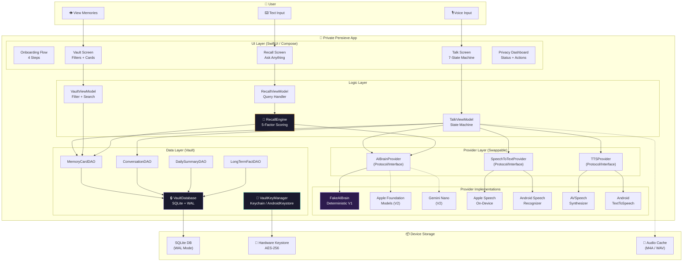
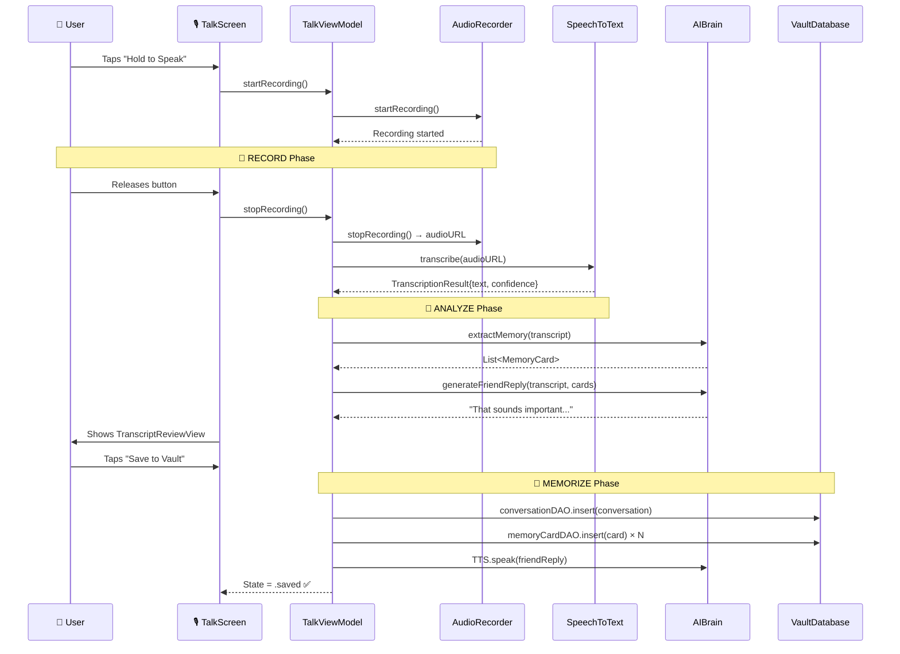
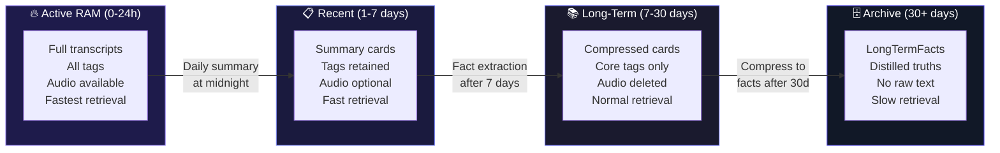
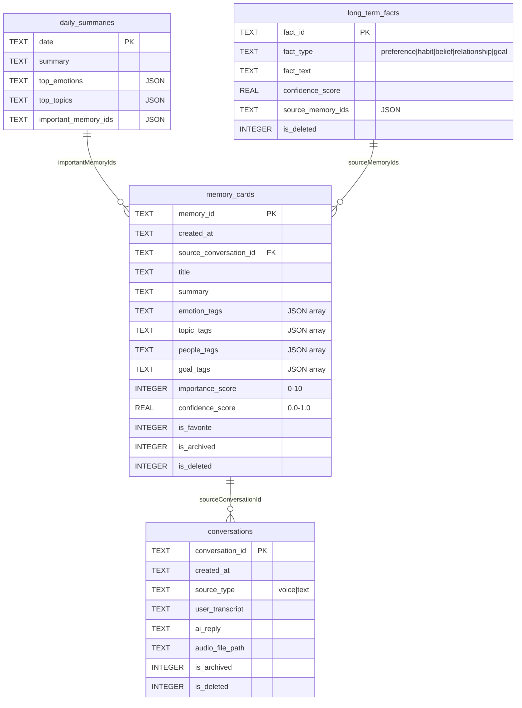

# Private Pensieve AI — Architecture & Algorithms

## 1. System Architecture Diagram



---

## 2. Data Flow: RAM Pipeline



---

## 3. The 4 Core Algorithms

---

### Algorithm 1: RAM Pipeline (Record → Analyze → Memorize)

The RAM pipeline converts raw voice input into structured, searchable memory cards.

```
┌─────────────────────────────────────────────────────────┐
│                    RAM PIPELINE                         │
│                                                         │
│  ┌──────────┐    ┌──────────┐    ┌──────────────────┐  │
│  │  RECORD   │───►│ ANALYZE  │───►│    MEMORIZE      │  │
│  │           │    │          │    │                  │  │
│  │ • Mic on  │    │ • STT    │    │ • Save convo    │  │
│  │ • M4A/WAV │    │ • Extract│    │ • Save cards    │  │
│  │ • Timer   │    │   cards  │    │ • Daily summary │  │
│  │ • Buffer  │    │ • Score  │    │ • LT facts      │  │
│  └──────────┘    └──────────┘    └──────────────────┘  │
│                                                         │
│  Input: Raw audio                                       │
│  Output: MemoryCards + Conversation + DailySummary      │
└─────────────────────────────────────────────────────────┘
```

**Pseudocode:**
```
function RAM(audioBuffer):
    // R — Record
    audioFile = writeToM4A(audioBuffer)
    
    // A — Analyze
    transcript = STT.transcribe(audioFile)
    memoryCards = AI.extractMemory(transcript)
    for each card in memoryCards:
        card.importanceScore = AI.assessImportance(card)
        card.confidenceScore = STT.confidence
        card.emotionTags = AI.detectEmotions(transcript)
        card.topicTags = AI.extractTopics(transcript)
        card.peopleTags = AI.extractPeople(transcript)
    
    // M — Memorize
    conversation = Conversation(transcript, timestamp)
    DB.conversations.insert(conversation)
    for each card in memoryCards:
        card.sourceConversationId = conversation.id
        DB.memoryCards.insert(card)
    
    if endOfDay():
        summary = AI.summarizeDay(todaysCards)
        DB.dailySummaries.upsert(summary)
        longTermFacts = AI.extractFacts(allCards)
        DB.longTermFacts.upsert(longTermFacts)
    
    return memoryCards
```

---

### Algorithm 2: Recall Scoring (5-Factor Weighted Formula)

The recall engine uses a **multi-factor weighted scoring algorithm** to rank memory cards by relevance to a user's question.

```
┌─────────────────────────────────────────────────────────┐
│              RECALL SCORING FORMULA                     │
│                                                         │
│  Score(card, query) =                                   │
│      0.35 × Lexical(card, query)    // text overlap     │
│    + 0.25 × TagMatch(card, query)   // tag intersection │
│    + 0.15 × Recency(card)           // time decay       │
│    + 0.15 × Importance(card)        // [0-10] / 10      │
│    + 0.10 × Confidence(card)        // STT confidence   │
│                                                         │
│  Evidence Threshold = 0.15                              │
│  Top-K = 5 cards max                                    │
│                                                         │
│  If no card passes threshold:                           │
│    → "I don't remember you telling me that yet."        │
└─────────────────────────────────────────────────────────┘
```

**Pseudocode:**
```
function Recall(question, allCards):
    keywords = extractKeywords(question)  // remove stop words
    
    scored = []
    for each card in allCards:
        // Factor 1: Lexical overlap (0.35)
        textMatches = count(keywords ∩ words(card.title + card.summary))
        lexical = textMatches / len(keywords)
        
        // Factor 2: Tag match (0.25)
        allTags = card.emotionTags ∪ topicTags ∪ peopleTags ∪ goalTags
        tagMatches = count(keywords ∩ allTags)
        tagMatch = tagMatches / len(keywords)
        
        // Factor 3: Recency — exponential decay (0.15)
        daysSince = (now - card.createdAt) / 86400
        recency = e^(-daysSince / 10)
        
        // Factor 4: Importance (0.15)
        importance = card.importanceScore / 10
        
        // Factor 5: Confidence (0.10)
        confidence = card.confidenceScore
        
        score = 0.35×lexical + 0.25×tagMatch + 0.15×recency 
              + 0.15×importance + 0.10×confidence
        
        scored.append((card, score))
    
    // Filter and rank
    evidence = scored
        .filter(score >= 0.15)      // evidence threshold
        .sortByDescending(score)
        .take(5)                    // top-K
    
    if evidence.isEmpty():
        return "I don't remember you telling me that yet."
    
    return AI.answerFromEvidence(question, evidence)
```

**Recency Decay Curve:**
```
Score
1.0 ┤ ●
0.8 ┤  ╲
0.6 ┤    ╲
0.5 ┤     ╲                    ← 7 days ≈ 0.50
0.4 ┤      ╲
0.2 ┤        ╲───
0.1 ┤            ╲─────        ← 30 days ≈ 0.05
0.0 ┤                  ╲──────
    └──┬──┬──┬──┬──┬──┬──┬──┬─── Days
       0  3  7  10 14 21 30 60
```

---

### Algorithm 3: Query Classification (Intent Detection)

Before searching, the engine classifies the query to determine the correct response strategy.

```
┌─────────────────────────────────────────────────────────┐
│           QUERY CLASSIFICATION TREE                     │
│                                                         │
│  Input: "What did I say about my career?"               │
│                     │                                   │
│               ┌─────┴─────┐                             │
│               │ Contains   │                            │
│               │ recall     │                            │
│               │ keywords?  │                            │
│               └─────┬─────┘                             │
│              yes/   │   \no                             │
│            ┌───┘    │    └───┐                           │
│            │        │        │                           │
│  ┌─────────┴─┐  ┌──┴──────┐ ┌┴──────────┐             │
│  │ MEMORY    │  │ Contains │ │ GENERAL   │             │
│  │ RECALL    │  │reflect   │ │ FRIEND    │             │
│  │           │  │keywords? │ │           │             │
│  │ → Search  │  └─┬─────┬─┘ │ → Chat    │             │
│  │   vault   │  yes│     │no │   reply   │             │
│  │ → Score   │    │     │   │ → No      │             │
│  │ → Answer  │    │     └──►│   search  │             │
│  └───────────┘    │         └───────────┘             │
│              ┌────┴─────┐                               │
│              │REFLECTION│                               │
│              │          │                               │
│              │→ Aggregate│                              │
│              │  patterns │                              │
│              └──────────┘                               │
└─────────────────────────────────────────────────────────┘
```

| Class | Trigger Keywords | Response Strategy |
|-------|-----------------|-------------------|
| **MEMORY_RECALL** | "what did I", "when did I", "did I say", "remind me", "tell me about" | Search vault → score → evidence-bound answer |
| **REFLECTION** | "pattern", "how often", "usually", "trend", "frequently" | Aggregate multiple cards → trend analysis |
| **GENERAL_FRIEND** | Everything else ("I'm feeling down", "hello") | Warm friend reply, no vault assertions |

---

### Algorithm 4: Memory Tiering (4-Tier Storage Strategy)

Memories move through 4 tiers based on age and importance, optimizing storage and retrieval.



**Transition Rules:**
```
function TierTransition():
    // Tier 1 → Tier 2: End of day
    at midnight:
        todaysCards = DB.memoryCards.where(createdAt = today)
        summary = AI.summarizeDay(todaysCards)
        DB.dailySummaries.upsert(summary)
        deleteAudioOlderThan(24h)  // unless user opted to retain
    
    // Tier 2 → Tier 3: After 7 days
    every 7 days:
        oldCards = DB.memoryCards.where(age > 7d, age <= 30d)
        for each card in oldCards:
            card.stripFullTranscript()   // keep summary only
            card.pruneMinorTags()        // keep top-3 tags only
            DB.memoryCards.update(card)
    
    // Tier 3 → Tier 4: After 30 days
    every 30 days:
        ancientCards = DB.memoryCards.where(age > 30d)
        facts = AI.extractLongTermFacts(ancientCards)
        DB.longTermFacts.upsert(facts)
        // Cards remain searchable but marked as archived
        ancientCards.forEach { it.isArchived = true }
```

---

## 4. Database Schema



---

## 5. Technology Stack Summary

| Layer | iOS | Android | Shared |
|-------|-----|---------|--------|
| **UI** | SwiftUI | Jetpack Compose | — |
| **State** | `@StateObject` + `ObservableObject` | `ViewModel` + `mutableStateOf` | — |
| **DB** | SQLite3 (C API) | `SQLiteOpenHelper` | Schema identical |
| **Key Store** | Keychain (AES-256) | AndroidKeystore (AES-256-GCM) | — |
| **Audio** | AVAudioEngine (M4A/AAC) | AudioRecord (WAV/PCM) | — |
| **STT** | SFSpeechRecognizer (on-device) | SpeechRecognizer (offline) | — |
| **TTS** | AVSpeechSynthesizer | TextToSpeech | — |
| **AI** | FakeAIBrain / Apple FM (V2) | FakeAIBrain / Gemini Nano (V2) | Protocol-based |
| **Navigation** | TabView + NavigationStack | Scaffold + NavigationBar | 4 tabs |
