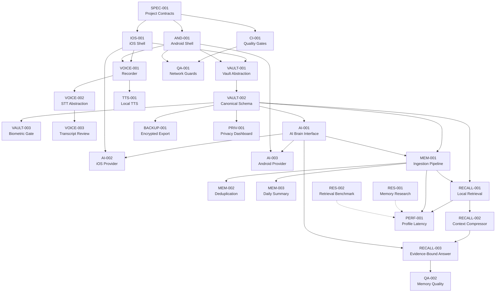

# Implementation Plan — Private Pensieve AI

> Generated: 2026-07-01
> Status: **Milestone 1 — Active**

---

## 1. Repository Audit Findings

### 1.1 Current State
| Area | Status | Notes |
|------|--------|-------|
| `AGENTS.md` | ✅ Complete | Non-negotiable constraints clear |
| `docs/PRD.md` | ✅ Complete | V1 scope well-defined |
| `docs/ARCHITECTURE.md` | ✅ Complete | Module boundaries defined |
| `docs/PRIVACY_RULES.md` | ✅ Complete | Forbidden dependency list explicit |
| `docs/MEMORY_SCHEMA.md` | ✅ Complete | 5 canonical entities specified |
| `docs/RECALL_PIPELINE.md` | ✅ Complete | Ranking weights defined |
| `docs/AGENT_TASKS.md` | ✅ Complete | P0/P1/P2 task board with owners |
| `docs/SECURITY_DESIGN.md` | ⚠️ Partial | Open decisions: KDF, container schema, secure deletion |
| `docs/AI_PROMPTS.md` | ✅ Complete | 5 prompt contracts |
| `docs/MEMORY_OPTIMIZATION.md` | ✅ Complete | 4-tier strategy defined |
| `docs/UI_UX_SPEC.md` | ⚠️ Baseline only | Needs full design system, screen states, component inventory |
| `docs/RELEASE_PLAN.md` | ✅ Complete | 8-week plan |
| `ios/` | ❌ Empty | No project scaffold |
| `android/` | ❌ Empty | No project scaffold |
| `.github/workflows/ci.yml` | ✅ Exists | Policy checks + Android build + iOS static check |
| `test_data/` | ✅ 2 fixtures | `sample_transcripts.json` + `recall_test_cases.json` |
| `docs/agent_logs/` | ⚠️ Template only | No agent log files yet |

### 1.2 Gaps Identified
1. **No `docs/DECISIONS.md`** — needed per kickoff prompt to track constraint modifications.
2. **No `docs/DESIGN_SYSTEM.md`** — color, typography, shape, and motion specs exist in user request but not yet in repo docs.
3. **No `docs/SCREEN_STATES.md`** — state machines for each screen not documented.
4. **No `docs/USER_FLOWS.md`** — end-to-end user journey maps not documented.
5. **No `docs/UI_COPY.md`** — canonical UI strings not collected.
6. **No iOS Xcode project** — `ios/` is empty.
7. **No Android Gradle project** — `android/` is empty.
8. **CI iOS job** is a stub (only lists files); needs real build/lint when project exists.
9. **CI policy grep** does not cover all forbidden patterns listed in `PRIVACY_RULES.md` (e.g., `crashlytics`, `appsflyer`, `braze`, `cloud_firestore`, `aws`, `azure`).
10. **No `docs/COMPONENT_INVENTORY.md`** — reusable UI component catalog not started.

### 1.3 Contradictions / Ambiguities
| # | Issue | Resolution |
|---|-------|------------|
| 1 | `ARCHITECTURE.md` says "Foundation Models abstraction when supported" but `PRD.md` lists it as V1 must-have | **Resolution**: AI interface is V1; specific Apple Foundation Models adapter is best-effort (AI-002). If device lacks on-device model, fake provider runs. |
| 2 | `MEMORY_SCHEMA.md` says MemoryEdge is "future-compatible" but `RECALL_PIPELINE.md` lists "Memory graph ranking" as future | **Consistent**: MemoryEdge is optional V1, not blocking. |
| 3 | `UI_UX_SPEC.md` is a baseline; user request provides a vastly more detailed spec | **Resolution**: User request spec becomes the authoritative design source; `UI_UX_SPEC.md` will be superseded by new design docs. |
| 4 | `SECURITY_DESIGN.md` has open KDF decision | **Resolution**: Defer KDF finalization to VAULT-001 task; document in `DECISIONS.md` when decided. |

---

## 2. Dependency Graph

```
SPEC-001 ─────────────────────────────────────────────────────────┐
                                                                   │
CI-001 ←── SPEC-001                                               │
                                                                   │
IOS-001 ←── SPEC-001                                              │
AND-001 ←── SPEC-001                                              │
                                                                   │
┌─ VAULT-001 ←── IOS-001, AND-001                                 │
│  VAULT-002 ←── VAULT-001                                        │
│  VAULT-003 ←── VAULT-002                                        │
│                                                                  │
├─ VOICE-001 ←── IOS-001, AND-001                                 │
│  VOICE-002 ←── VOICE-001                                        │
│  VOICE-003 ←── VOICE-002                                        │
│  TTS-001 ←── VOICE-001                                          │
│                                                                  │
├─ AI-001 ←── VAULT-002 (needs schema)                            │
│  AI-002 ←── AI-001, IOS-001                                     │
│  AI-003 ←── AI-001, AND-001                                     │
│                                                                  │
├─ MEM-001 ←── VAULT-002, AI-001                                  │
│  MEM-002 ←── MEM-001                                            │
│  MEM-003 ←── MEM-001                                            │
│                                                                  │
├─ RECALL-001 ←── VAULT-002, MEM-001                              │
│  RECALL-002 ←── RECALL-001                                      │
│  RECALL-003 ←── RECALL-002, AI-001                              │
│                                                                  │
├─ BACKUP-001 ←── VAULT-002                                       │
├─ PRIV-001 ←── VAULT-002                                         │
│                                                                  │
├─ QA-001 ←── CI-001, AND-001                                     │
│  QA-002 ←── RECALL-003                                          │
│  PERF-001 ←── RECALL-001, MEM-001                               │
│                                                                  │
└─ RES-001, RES-002 ←── (parallel, no blockers)                   │
```

### Mermaid Dependency Graph



---

## 3. Workstream Plan

### 3.1 Branch / Worktree Map

| Branch | Owner | Scope | P-level | Dependencies |
|--------|-------|-------|---------|--------------|
| `feature/ci-cd` | CI/CD Agent | CI-001, QA-001 | P0 | SPEC-001 |
| `feature/ios-core` | iOS Agent | IOS-001, UI scaffolding | P0 | SPEC-001 |
| `feature/android-core` | Android Agent | AND-001, UI scaffolding | P0 | SPEC-001 |
| `feature/vault-security` | Vault Agent | VAULT-001, VAULT-002, VAULT-003 | P1 | IOS-001, AND-001 |
| `feature/voice-engine` | Voice Agent | VOICE-001, VOICE-002, VOICE-003, TTS-001 | P1 | IOS-001, AND-001 |
| `feature/memory-engine` | Memory Agent | MEM-001, MEM-002, MEM-003 | P1 | VAULT-002, AI-001 |
| `feature/recall-engine` | Recall Agent | RECALL-001, RECALL-002, RECALL-003 | P1 | VAULT-002, MEM-001, AI-001 |
| `feature/ai-brain` | AI Brain Agent | AI-001, AI-002, AI-003 | P1 | VAULT-002 |
| `research/memory-optimization` | Research Agent | RES-001, RES-002 | Parallel | None |

### 3.2 Platform Ownership Matrix

| Component | iOS Owner | Android Owner | Shared Contract |
|-----------|-----------|---------------|-----------------|
| App Shell / Navigation | iOS Agent | Android Agent | Tab order: Talk, Vault, Recall, Privacy |
| Design System tokens | iOS Agent (SwiftUI) | Android Agent (Compose) | `docs/DESIGN_SYSTEM.md` |
| Memory models | iOS Agent (Swift structs) | Android Agent (Kotlin data classes) | `docs/MEMORY_SCHEMA.md` |
| Vault Repository | iOS Agent (Keychain + SQLCipher) | Android Agent (Keystore + Room/SQLCipher) | `docs/SECURITY_DESIGN.md` |
| STT Provider | iOS Agent (Speech framework) | Android Agent (SpeechRecognizer) | `SpeechToTextProvider` protocol |
| TTS Provider | iOS Agent (AVSpeechSynthesizer) | Android Agent (TextToSpeech) | `TTSProvider` protocol |
| AI Brain | iOS Agent (Foundation Models) | Android Agent (Gemini Nano/AICore) | `AIBrainProvider` protocol |
| Recall Engine | Shared algorithm spec | Platform-specific implementation | `docs/RECALL_PIPELINE.md` |

---

## 4. Milestone 1 — Foundation (Week 1)

### 4.1 Acceptance Criteria

| # | Criterion | Verification |
|---|-----------|-------------|
| M1-1 | Both native app shells build with Talk, Vault, Recall, Privacy tabs | `xcodebuild` succeeds; `./gradlew assembleDebug` succeeds |
| M1-2 | Android has no INTERNET permission | `grep -r "android.permission.INTERNET" android` returns empty |
| M1-3 | CI rejects cloud, analytics, remote-AI, and login deps | CI policy job passes; manually verified with test injection |
| M1-4 | Canonical memory models match `MEMORY_SCHEMA.md` on both platforms | Schema parity review document; round-trip unit tests |
| M1-5 | Deterministic fake local providers support save-and-recall tests | Unit tests pass with `FakeAIBrain`, `FakeSpeechToText` |
| M1-6 | Tests include exact fallback: "I don't remember you telling me that yet." | Test case `r002` from `recall_test_cases.json` asserts exact string |

### 4.2 Deliverables Checklist

```
[ ] docs/IMPLEMENTATION_PLAN.md          ← this file
[ ] docs/DECISIONS.md                     ← constraint change log
[ ] docs/DESIGN_SYSTEM.md                ← full color/type/shape/motion spec
[ ] docs/SCREEN_STATES.md                ← state machines per screen
[ ] docs/USER_FLOWS.md                   ← journey maps
[ ] docs/UI_COPY.md                      ← canonical strings
[ ] docs/COMPONENT_INVENTORY.md          ← reusable component catalog

[ ] ios/PrivatePensieve.xcodeproj        ← Xcode project
[ ] ios/PrivatePensieve/App.swift        ← SwiftUI app entry
[ ] ios/PrivatePensieve/Navigation/      ← Tab navigation
[ ] ios/PrivatePensieve/Screens/         ← Talk, Vault, Recall, Privacy stubs
[ ] ios/PrivatePensieve/Models/          ← Canonical schema models
[ ] ios/PrivatePensieve/Providers/       ← Fake AI, STT, TTS providers
[ ] ios/PrivatePensieveTests/            ← Unit test target

[ ] android/app/build.gradle.kts         ← Gradle config (no INTERNET)
[ ] android/app/src/main/AndroidManifest.xml  ← No INTERNET permission
[ ] android/...Navigation.kt             ← Tab navigation
[ ] android/...screens/                   ← Talk, Vault, Recall, Privacy stubs
[ ] android/...models/                    ← Canonical schema models
[ ] android/...providers/                 ← Fake AI, STT, TTS providers
[ ] android/app/src/test/                 ← Unit tests

[ ] .github/workflows/ci.yml             ← Enhanced policy checks
[ ] docs/agent_logs/lead-agent.md        ← This session's log
[ ] test_data/recall_test_cases.json     ← Existing (verified)
[ ] test_data/sample_transcripts.json    ← Existing (verified)
```

---

## 5. Milestone 2 — Secure Local Vault (Week 2)

### Acceptance Criteria
- Encrypted SQLite vault opens/closes with Keychain/Keystore-derived key
- Conversation, MemoryCard, DailySummary, LongTermFact tables created
- CRUD + migration tests pass
- Biometric/passcode gate protects vault access
- No plaintext persistence in app documents directory
- `SECURITY_DESIGN.md` updated with finalized KDF and container schema

---

## 6. Milestone 3 — Voice Experience (Week 3)

### Acceptance Criteria
- Recording starts/stops via hold or tap mode
- Fake STT provider returns deterministic transcripts in tests
- Transcript review screen allows edit/save/discard
- TTS reads AI response aloud; mute/replay controls work
- Audio retention defaults to OFF; temporary files cleaned after transcription
- Microphone-denied state handled gracefully

---

## 7. Milestone 4 — Memory Ingestion (Week 4)

### Acceptance Criteria
- Transcript → MemoryCard extraction via AI brain interface
- Fixture tests against `sample_transcripts.json` produce expected cards
- Deduplication prevents duplicate cards from repeated statements
- Daily summary rolls up incrementally
- LongTermFact promotion requires confirmation flag

---

## 8. Milestone 5 — Recall Engine (Week 5)

### Acceptance Criteria
- Query classifier categorizes MEMORY_RECALL / REFLECTION / GENERAL_FRIEND
- Metadata + full-text search returns ranked candidates
- Ranking uses documented weights (lexical 0.35, tag 0.25, recency 0.15, importance 0.15, confidence 0.10)
- Context compressor limits to 3–5 evidence cards
- No-evidence fallback returns exact string: "I don't remember you telling me that yet."
- `recall_test_cases.json` fixtures pass

---

## 9. Milestone 6 — On-Device AI (Week 6)

### Acceptance Criteria
- AI brain interface supports `generateFriendReply`, `extractMemory`, `summarizeDay`, `answerFromEvidence`
- iOS adapter wraps Apple Foundation Models (graceful unavailable state)
- Android adapter wraps Gemini Nano/AICore (graceful unavailable state)
- No remote fallback in any code path
- All app features run against fake provider in tests

---

## 10. Milestone 7 — Backup, Privacy, Performance (Week 7)

### Acceptance Criteria
- Encrypted `.pensieve` export/import with password-derived key
- Wrong password and corrupt file fail safely
- Privacy dashboard shows all status items from spec
- Delete-all workflows require confirmation
- Offline test matrix documented
- Storage/latency profiling at 100/1K/5K memories

---

## 11. Milestone 8 — Release Candidate (Week 8)

### Acceptance Criteria
- Accessibility audit: Dynamic Type, VoiceOver, TalkBack, Reduce Motion
- License/privacy audit for all dependencies
- TestFlight build for iOS
- Play Internal Testing build for Android
- Release notes drafted

---

## 12. Risk Register

| # | Risk | Impact | Likelihood | Mitigation |
|---|------|--------|------------|------------|
| R1 | Apple Foundation Models unavailable on target test devices | AI features untestable on real device | Medium | Fake provider ensures all tests pass; adapter is best-effort |
| R2 | Gemini Nano / AICore availability limited to Pixel 8+ | Narrow Android device coverage | Medium | Fake provider as default; document minimum device requirements |
| R3 | SQLCipher adds binary size and build complexity | Build time, app size increase | Low | Evaluate built-in SQLite encryption alternatives first |
| R4 | On-device STT quality varies by device/OS | Poor transcription quality | Medium | Transcript review screen allows editing; fake provider for tests |
| R5 | Full-text search insufficient for recall quality at scale | Poor recall precision | Low | `PERF-001` benchmarks before adding vector DB |
| R6 | Scope creep from design spec (10+ screens) delays Week 1 | Foundation milestone blocked | Medium | Week 1 builds stubs only; full UI is P1 |
| R7 | No macOS CI runner for iOS builds | iOS build not validated in CI | High | Use `macos-latest` runner; fallback to local `xcodebuild` validation |

---

## 13. Design Documentation Roadmap

The user request provides an extremely detailed UI/UX specification that goes far beyond the baseline `UI_UX_SPEC.md` in the repo. The following new documents will be created as part of the design workstream:

| Document | Contents | Status |
|----------|----------|--------|
| `docs/DESIGN_SYSTEM.md` | Colors, typography, shapes, motion, accessibility tokens | To create |
| `docs/SCREEN_STATES.md` | State machines for all 10 screens + sub-screens | To create |
| `docs/USER_FLOWS.md` | Onboarding, save memory, recall memory, manage vault, backup | To create |
| `docs/UI_COPY.md` | All canonical UI strings, fallback text, error messages | To create |
| `docs/COMPONENT_INVENTORY.md` | 15 reusable components with platform-specific notes | To create |

---

## 14. Enhancement Opportunities Identified

See companion document: `docs/ENHANCEMENT_PROPOSALS.md`
