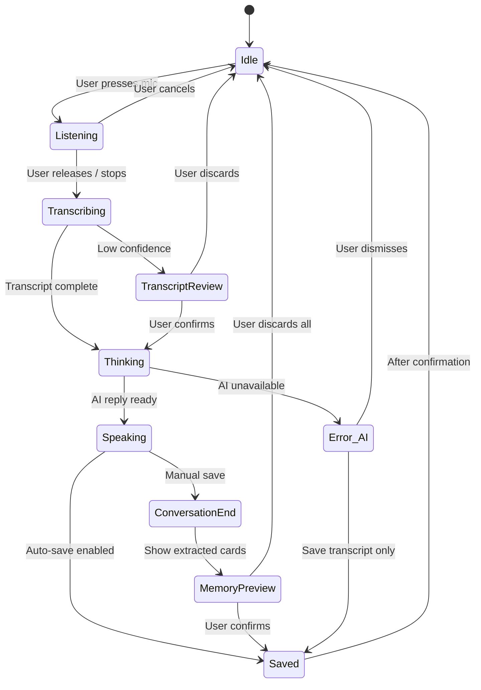

# Screen States — Private Pensieve AI

> Every screen has defined states: default, empty, loading, error, and offline.
> Reduce Motion alternatives noted where applicable.

---

## 1. Talk Screen

| State | Orb | Primary Text | Secondary Text | Controls |
|-------|-----|-------------|----------------|----------|
| Idle | Breathing (7s cycle) | "I'm here." | "Talk freely. I'll remember what matters." | Hold to Speak |
| Listening | Amplitude pulse | "I'm listening…" | Live transcript (bottom sheet) | Release to finish |
| Transcribing | Gentle shimmer | "Turning your voice into words…" | Horizontal shimmer bar | — |
| Thinking | Ripple rings | "Finding the right words…" | — | — |
| Speaking | Gentle sway | AI response card | — | Replay, Stop |
| Saved | Glow flash (600ms) | "Saved privately to your vault." | — | View Memory, Undo |
| Error (mic denied) | Static | "Microphone access needed" | "Open Settings to enable" | Open Settings |
| Error (AI unavailable) | Static dim | "AI features warming up" | "Your words were saved" | View transcript |
| Empty (first use) | Breathing | "I'm here." | "Press the mic to start talking." | Hold to Speak |

---

## 2. Transcript Review Screen

| State | Content | Actions |
|-------|---------|---------|
| Default | Editable transcript text | Looks right, Edit, Don't save, Save as memory |
| Low confidence | Transcript + "Some words may need a quick check." | Same |
| Empty transcript | "I couldn't catch that. Try speaking again?" | Try again, Cancel |
| Editing | Text field focused, keyboard visible | Done, Cancel |

---

## 3. Conversation View

| State | Content | Actions |
|-------|---------|---------|
| Active | Flowing conversation thread | Continue talking, Save this moment, End |
| Ended | "What I'll remember" + memory preview cards | Save all, Edit, Discard |
| Empty | "Start a conversation from the Talk tab." | Go to Talk |

---

## 4. Vault Screen

| State | Content | Actions |
|-------|---------|---------|
| Default | Memory card list with filters | Search, Filter, Sort |
| Empty | "Your vault is waiting." / "The moments you choose to save will appear here." | Talk to me (CTA) |
| Loading | Skeleton cards (3 placeholder cards, shimmer) | — |
| Filtered (no results) | "No memories match this filter." | Clear filters |
| Search (no results) | "No memories found for '[query]'." | Clear search |

---

## 5. Memory Detail Screen

| State | Content | Actions |
|-------|---------|---------|
| Default | Full memory card: title, summary, chips, linked memories | Favorite, Edit, Delete, Related |
| With audio | Same + audio playback controls | Play, Delete audio |
| Editing tags | Chip editor visible | Add tag, Remove tag, Done |
| Delete confirmation | "Delete this memory from your device? This cannot be undone unless it exists in an exported backup." | Delete (red), Cancel |
| Deleted (toast) | "Memory deleted. Undo?" (10s grace period) | Undo |

---

## 6. Recall Screen

| State | Content | Actions |
|-------|---------|---------|
| Default | "Ask your past self" + input + suggested questions | Voice/text input |
| Empty (no memories) | "No memories yet. Start a conversation and save some memories first." | Talk to me |
| Searching | "Searching your memories…" + shimmer | — |
| Results found | "I found N memories related to this." + evidence cards + human answer | Ask another, View memory |
| No results | "I don't remember you telling me that yet." + "Would you like to talk about it now?" | Talk about it |
| Error | "Something went wrong searching your memories." | Try again |

---

## 7. Timeline Screen (secondary from Vault)

| State | Content | Actions |
|-------|---------|---------|
| Default | Reflection blocks by time period | Time filter: Today/Week/Month/Year |
| Empty | "Your story is just beginning. As you save memories, your timeline will unfold." | — |
| Loading | Skeleton blocks | — |
| Filtered (empty period) | "No memories during this time." | Change filter |

---

## 8. Privacy Screen

| State | Content | Actions |
|-------|---------|---------|
| Default | Status list (all green) + action buttons | Export, Import, Delete, View promise |
| After deletion | Updated status, confirmation toast | — |
| Export in progress | "Encrypting your backup…" + progress | Cancel |
| Export complete | "Backup saved to [location]." | Share, Done |
| Import in progress | "Decrypting backup…" + progress | Cancel |
| Import preview | "This backup contains N memories from [date]." | Import all, Cancel |
| Import wrong password | "Incorrect password for this backup." | Try again |
| Import corrupt | "This backup file couldn't be opened." | Choose another file |

---

## 9. Onboarding Screens

### 9A — Welcome
| State | Content |
|-------|---------|
| Default | Orb + "Private Pensieve" + privacy chips (animated stagger fade-in) |

### 9B — Privacy Promise
| State | Content |
|-------|---------|
| Default | Visual flow diagram + bullet points |

### 9C — Vault Protection
| State | Content |
|-------|---------|
| Default | Passcode creation + biometric toggle + backup warning |
| Passcode mismatch | "Passcodes don't match. Try again." |

### 9D — Offline Brain Setup
| State | Content |
|-------|---------|
| Default | 3 AI options with recommendations |
| Download in progress | Progress bar for brain pack |
| Download complete | Checkmark + "Ready" |

---

## 10. Offline Brain Manager (secondary from Privacy)

| State | Content | Actions |
|-------|---------|---------|
| Default | Pack list with status | Download, Delete |
| Downloading | Progress bar per pack | Cancel |
| Insufficient storage | "Not enough storage for this pack (need X MB)." | Manage storage |
| Download complete | "Ready" badge | — |
