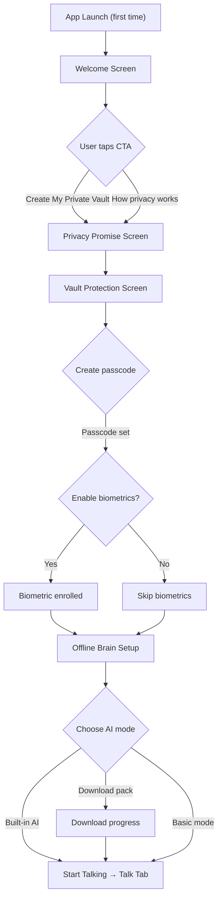
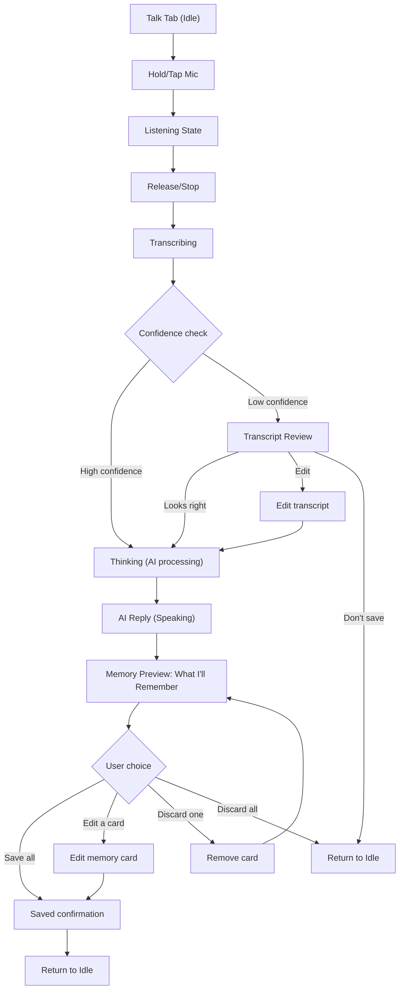
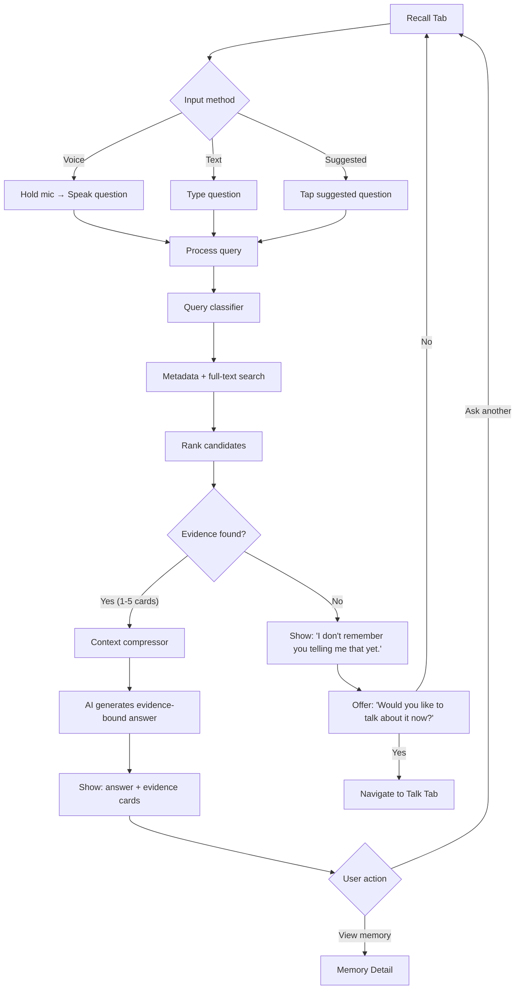
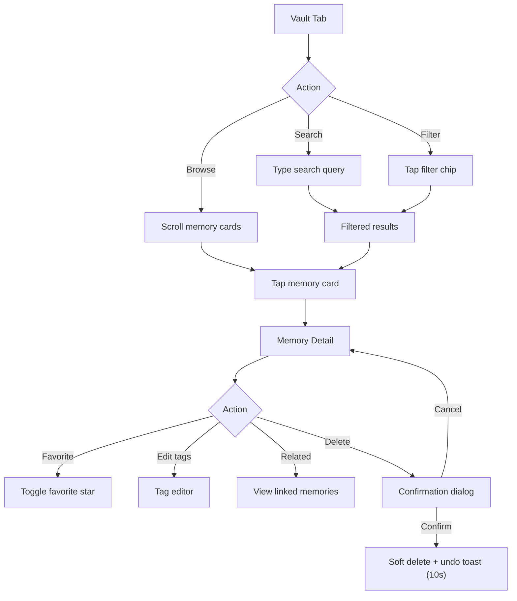
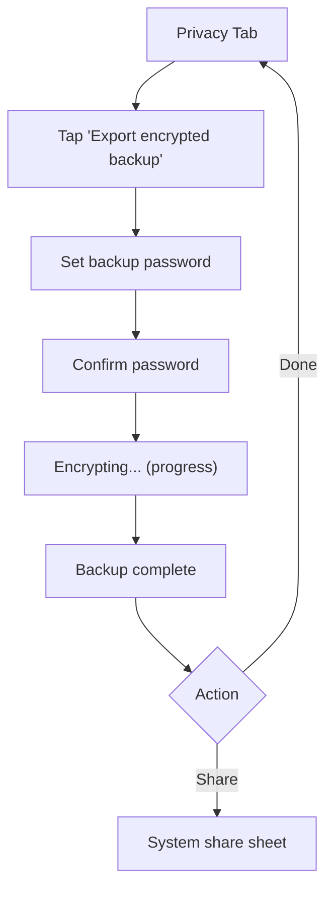
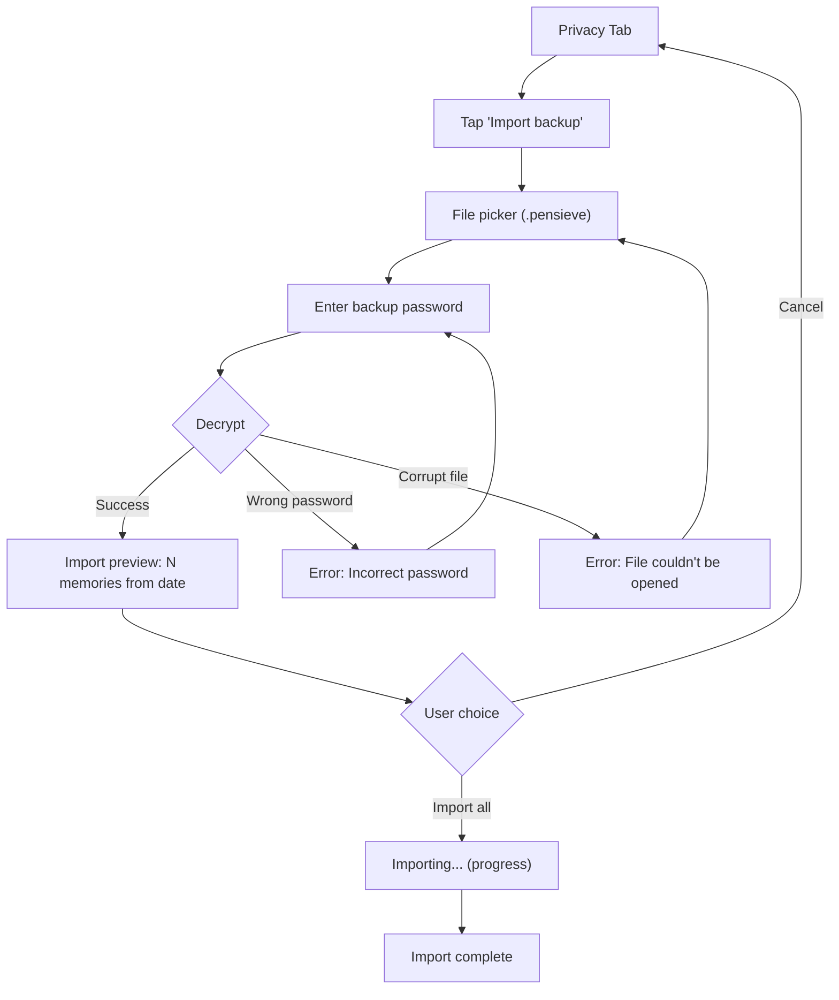
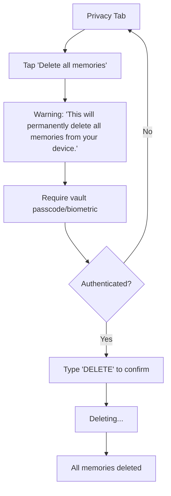
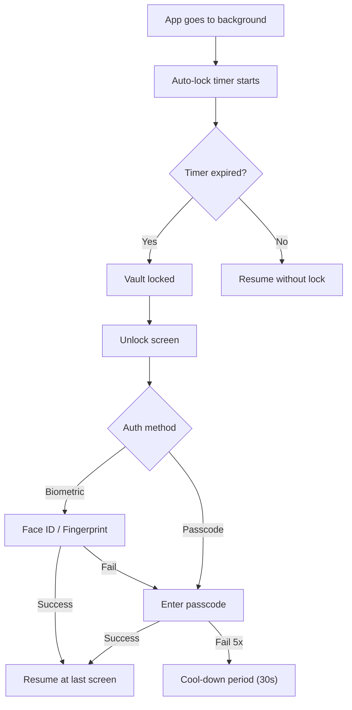
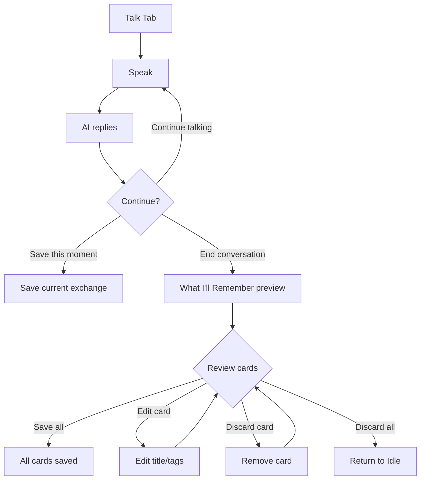

# User Flows — Private Pensieve AI

> End-to-end journey maps for all primary and secondary user flows.

---

## Flow 1: First-Time User Onboarding

**Duration target**: Under 60 seconds from launch to first voice interaction.

---

## Flow 2: Save a Voice Memory

**Key invariant**: No network call at any step. Audio file deleted after transcription unless retention is ON.

---

## Flow 3: Recall a Memory

**Critical invariant**: If no evidence passes threshold, the EXACT text must be: `I don't remember you telling me that yet.`

---

## Flow 4: Manage Vault

---

## Flow 5: Export Encrypted Backup

**Security**: Password-derived key via KDF. Per-backup salt and nonce. AES-256-GCM authenticated encryption.

---

## Flow 6: Import Backup

---

## Flow 7: Delete All Data

**Design principle**: Maximum friction for destructive actions. Three-step confirmation.

---

## Flow 8: App Resume / Vault Unlock

---

## Flow 9: Conversation View

